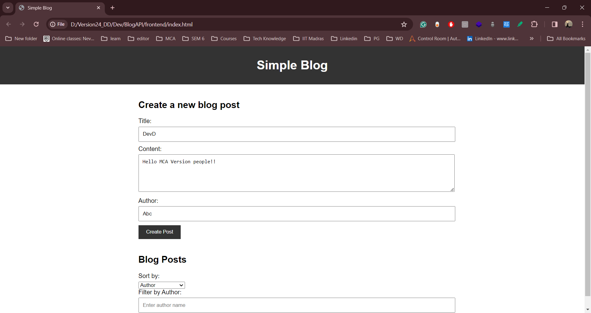

<h1 align="center"><b>Simple Blog API</b></h1>

<h4 align="center">This project perform CRUD (Create, Read, Update, Delete) operations on blog posts. The API handles blog post data, including titles, content, publication dates, and author information.
</h4>    

 

## How to set up 

1. git clone the project.
2. Open the folder in the terminal.
3. Check that you have npm and node installed.
4. Install the project dependencies using the following command:
    npm install express body-parser mongoose

5. To run the project 
    node index.js

## How to test the project

1. Inside the frontend folder, open the index.html file
2. Fill in the details and click on the button 

  

